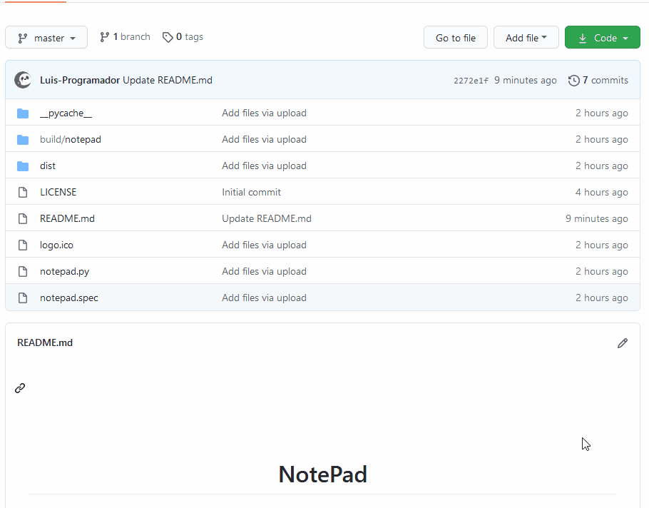

<h1 align="center">
 
  
 
 
NotePad
</h1>

Seu notepad feito em Python

  

## ✅ | VIDEO

    

## 🚀 | TECNOLOGIAS

- 🧪 | PYTHON
- 🎨 | PySimpleGUI

## 🔨 | FERRAMENTAS

💻 Visual Studio Code

## 👉 | COMO BAIXAR E USAR?
  
  <h4>AVISO!!</h4>
  - Qundo você baixar o app o windows ou seu anti virus, Bloqueará o app porque o app não é reconhecido e achara que é virus! Mais ai é só pertimitir o app e usar.
  - Podem confiar

    

<h2>🌠 | INSTAGRAM</h2>

https://www.instagram.com/lszofficial/

## 📜 LICENSE

This project is licensed under the MIT License - see the [LICENSE](https://opensource.org/licenses/MIT) page for details.
